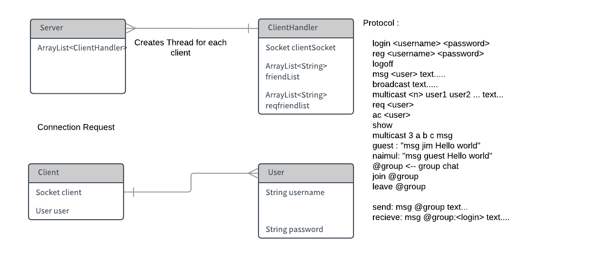

## Developing a multi-threaded server-client application using TCP Sockets

##### Author:

##### Naimul Haque


# Developing a multi-threaded server-client application


## 1 IMPLEMENTATION SUMMARY:

 Following features are asked to be

 implemented in the assignment of ‘Developing

a multi-threaded server-client application

 using TCP Sockets’ :

* Section Status
* Register and Login Implemented
* Online User Lists Implemented
* Friend Request: Implemented
* Unicast Implemented
* Multicast Implemented
* Broadcast Implemented
*Chat Room Implemented


## 2 IMPLEMENTATION CHALLENGES

The challenges I found while trying to

 implement follow features :

###  1) Register and Login
 It was really challenging to implement register because of validation of the new

 the user requires checking all client objects’

 username and password.

 To implement login was a challenging

 since no database to store the registered

 users,ArrayList data structure was used

 to store the users with validity.

### 2) Online User Lists

 To implement online users I used

 interface for all clients to react to

 another client’s online status

### 3) Friend Request

 To implement this feature separately

 functions where implemented to send

 request from a user and to accept

 request from another user and update

 the friendlist accordingly

### 4) Unicast

 This feature was fairly easy to implement

 using a ‘msg user’ protocol with server

### 5) Multicast

 Challenge was to implent the protocol is

 used to multicast ‘multicast <n> user

 user2 ... text...’ which requires to iterate

 for n users

### 6) Broadcast

 It was easiest to implement as

 broadcasting requires to send a message

 to all clients with protocol ‘broadcast

 text.....’

### 7) Chat Room

To implement it required to add users to

 a group which they can join using protocol

 ‘join @group’ where sever understand

 that it’s a group by ‘@’ character in front

 of the name


##### 3 INTERACTIONDIAGRAM

An interaction diagram is shown below to give

 an idea how the chat application works :



##### APPENDIX

##### CODE

###### The Java code for designing a minimum dis-

###### tance to class mean appl :

###### Server Package:

###### Server.java

package server ;

import java. io. IOException ;
import java. net. ServerSocket ;
import java. net. Socket ;
import java. u t i l. ArrayList ;
import java. u t i l. logging. Level ;
import java. u t i l. logging. Logger ;

```
c l a s s Server extends Thread {
```
```
private f i n a l i n t serverPort ;
private ArrayList <ClientHandler > workerList = new ArrayList < >() ;
private ArrayList <User> validUsers = new ArrayList < >() ;
```
```
public Server ( i n t serverport ) {
t h i s. serverPort = serverport ;
}
```
```
@Override
public void run ( ) {
ServerSocket serverSocket ;
try {
serverSocket = new ServerSocket ( serverPort ) ;
```
```
while ( true ) {
System. out. println ( "The server i s waiting for c l i e n t... " ) ;
Socket clientSocket = serverSocket. accept ( ) ;
System. out. println ( "The server i s conneted to c l i e n t
"+clientSocket ) ;
```
```
ClientHandler clientHandler = new
ClientHandler ( this , clientSocket ) ;
workerList. add ( clientHandler ) ;
clientHandler. s t a r t ( ) ;
}
```
```
} catch ( IOException ex ) {
Logger. getLogger ( Server. c l a s s. getName ( ) ). log ( Level. SEVERE,
null , ex ) ;
}
```
```
}
```
```
ArrayList <ClientHandler > getWorkerList ( ) {
return workerList ;
}
```
```
void remove ( ClientHandler clientHandler ) {
workerList. remove ( clientHandler ) ;
}
```
```
public ArrayList <User> getValidUsers ( ) {
return validUsers ;
}
```
```
public void addUser ( User user ) {
validUsers. add ( user ) ;
}
```
```
public void removeValidUsers ( User user ) {
validUsers. remove ( user ) ;
}
}
```
###### ClientHandler.java

```
//Naimul Haque
```
```
package server ;
```
```
import java. io. BufferedReader ;
import java. io. IOException ;
import java. io. InputStream ;
import java. io. InputStreamReader ;
import java. io. OutputStream ;
import java. net. Socket ;
import java. u t i l. ArrayList ;
import java. u t i l. HashSet ;
import java. u t i l. logging. Level ;
import java. u t i l. logging. Logger ;
import org. apache. commons. lang3. S t r i n g U t i l s ;
```
```
public c l a s s ClientHandler extends Thread {
```
```
private f i n a l Socket clientSocket ;
private String login = null ;
private String password = null ;
private boolean isOnline ;
private Server server ;
private OutputStream outputStream ;
private HashSet<String > groupSet = new HashSet < >() ;
private ArrayList <String > f r i e n d L i s t = new ArrayList < >() ;
private ArrayList <String > r e q f r i e n d l i s t = new ArrayList < >() ;
```
```
public ClientHandler ( Server server , Socket clientSocket ) {
t h i s. server = server ;
t h i s. clientSocket = clientSocket ;
t h i s. isOnline = f a l s e ;
}
```
```
@Override
public void run ( ) {
try {
```
```
handleClientSocket ( ) ;
```
```
} catch ( IOException ex ) {
Logger. getLogger ( ClientHandler. c l a s s. getName ( ) ). log ( Level. SEVERE,
null , ex ) ;
}
}
```
```
private void handleClientSocket ( ) throws IOException {
t h i s. outputStream = clientSocket. getOutputStream ( ) ;
```
```
InputStream inputStream = clientSocket. getInputStream ( ) ;
BufferedReader reader = new BufferedReader (new
InputStreamReader ( inputStream ) ) ;
```
```
String l i n e ;
```
```
while ( ( l i n e = reader. readLine ( ) ) != null ) {
String [ ] tokens = S t r i n g U t i l s. s p l i t ( l i n e ) ;
```
```
i f ( tokens != null&& tokens. length > 0) {
```

```
String command = tokens [ 0 ] ;
```
```
i f (command. equalsIgnoreCase ( " quit " ) ||
command. equals ( " logoff " ) ) {
handleLogoff ( ) ;
break ;
}
else i f (command. equalsIgnoreCase ( " reg " ) ) {
```
```
handleRegister ( outputStream , tokens ) ;
```
```
}
else i f (command. equalsIgnoreCase ( " broadcast " ) ) {
String [ ] broadcastMsgTokens =
S t r i n g U t i l s. s p l i t ( line , null , 2 ) ;
handleBroadcast ( broadcastMsgTokens ) ;
}
else i f (command. equalsIgnoreCase ( " multicast " ) ) {
handleMulticast ( tokens , l i n e ) ;
}
else i f (command. equalsIgnoreCase ( "msg" ) )
{
String [ ] directMsgTokens =
S t r i n g U t i l s. s p l i t ( line , null , 3 ) ;
handleMessage ( directMsgTokens ) ;
}
else i f (command. equalsIgnoreCase ( " j oin " ) ) {
handleJoin ( tokens ) ;
}
else i f (command. equalsIgnoreCase ( "show" ) ) {
handleShowList ( ) ;
}
else i f (command. equalsIgnoreCase ( " req " ) ) {
handleRequest ( tokens ) ;
}
else i f (command. equalsIgnoreCase ( " ac " ) ) {
handleAccept ( tokens ) ;
}
else i f (command. equalsIgnoreCase ( " leave " ) ) {
handleLeave ( tokens ) ;
}
else i f (command. equalsIgnoreCase ( " login " ) ) {
```
```
handleLogin ( outputStream , tokens ) ;
}
else {
String msg = "Unkown Command: " + command + "\n" ;
outputStream. write (msg. getBytes ( ) ) ;
}
```
```
}
```
```
}
```
}

private void handleRegister ( OutputStream outputStream , String [ ]
tokens ) throws IOException {
i f ( tokens. length == 3) {
String username = tokens [ 1 ] ;
String password = tokens [ 2 ] ;

```
User newUser = new User ( username , password ) ;
```
```
boolean isValidId = true ;
```
```
for ( User user : server. getValidUsers ( ) ) {
```
```
i f ( user. getUserName ( ). equals ( username ) ||
user. getPassword ( ). equals ( password ) ) {
String error = "Username or password already
e x i t " + "\n" ;
outputStream. write ( error. getBytes ( ) ) ;
isValidId = f a l s e ;
```
```
System. err. println ( " Registration f a i l e d " ) ;
break ;
}
}
```
```
i f ( isValidId ) {
server. addUser ( newUser ) ;
```
```
String msg = "Ok login " +"\n" ;
outputStream. write (msg. getBytes ( ) ) ;
t h i s. login = newUser. username ;
t h i s. password = newUser. password ;
```
```
System. out. println ( " User logged in successfully :
"+login ) ;
```
```
ArrayList <ClientHandler > workerList =
server. getWorkerList ( ) ;
```
```
//send current user a l l other online users
for ( ClientHandler worker : workerList ) {
```
```
i f ( worker. getLogin ( ) != null &&
! login. equals ( worker. getLogin ( ) ) ) {
String msg2 = " online " +
worker. getLogin ( ) + "\n" ;
send (msg2) ;
}
```
```
}
```
```
//send other online users current user ’ s status
String onlineMsg = " online " + login + "\n" ;
for ( ClientHandler worker : workerList ) {
```
```
i f (! login. equals ( worker. getLogin ( ) ) ) {
worker. send ( onlineMsg ) ;
}
}
```
```
}
```
```
}
}
```
```
private void handleLogin ( OutputStream outputStream , String [ ]
tokens ) throws IOException {
i f ( tokens. length == 3) {
String login = tokens [ 1 ] ;
String password = tokens [ 2 ] ;
```
```
User reqUser = new User ( login , password ) ;
```
```
for ( User user : server. getValidUsers ( ) ) {
i f ( user. username. equals ( reqUser. username ) &&
user. password. equals ( reqUser. password ) ) {
isOnline = true ;
break ;
}
}
```
```
i f ( isOnline ) {
```
```
String msg = "Ok login " +"\n" ;
outputStream. write (msg. getBytes ( ) ) ;
t h i s. login = login ;
```
```
System. out. println ( " User logged in successfully :
"+login ) ;
```
```
ArrayList <ClientHandler > workerList =
server. getWorkerList ( ) ;
```
```
//send current user a l l other online users
for ( ClientHandler worker : workerList ) {
```
```
i f ( worker. getLogin ( ) != null &&
! login. equals ( worker. getLogin ( ) ) ) {
String msg2 = " online " +
worker. getLogin ( ) + "\n" ;
send (msg2) ;
}
```
```
}
```
```
//send other online users current user ’ s status
String onlineMsg = " online " + login + "\n" ;
for ( ClientHandler worker : workerList ) {
```
```
i f (! login. equals ( worker. getLogin ( ) ) ) {
worker. send ( onlineMsg ) ;
}
}
} else {
String msg = " Error login " + login + "\n" ;
outputStream. write (msg. getBytes ( ) ) ;
```
```
System. err. println ( " Login f a i l e d for : "+login ) ;
}
}
}
```
```
String getLogin ( )
{
return login ;
}
```
```
private void send ( String msg) throws IOException {
i f ( login != null )
{
```

```
outputStream. write (msg. getBytes ( ) ) ;
}
```
}

private void handleLogoff ( ) throws IOException {
server. remove ( t h i s ) ;
ArrayList <ClientHandler > workerList = server. getWorkerList ( ) ;
//send other online users current user ’ s status
String onlineMsg = " o f f l i n e " + login + "\n" ;
for ( ClientHandler worker : workerList ) {

```
i f (! login. equals ( worker. getLogin ( ) ) ) {
worker. send ( onlineMsg ) ;
}
}
clientSocket. close ( ) ;
```
}

private void handleMessage ( String [ ] tokens ) throws IOException {
String reciever = tokens [ 1 ] ;
String msg = tokens [ 2 ] ;

```
boolean isGroupMsg = reciever. charAt ( 0 ) == ’@’ ;
```
```
ArrayList <ClientHandler > workerList = server. getWorkerList ( ) ;
for ( ClientHandler clientHandler : workerList )
{
i f ( isGroupMsg ) {
```
```
i f ( clientHandler. isMemberOfGroupSet ( reciever ) &&
f r i e n d L i s t. contains ( reciever ) ) {
```
```
String outMessage = "msg " + reciever+" : "+login +
" " + msg + "\n" ;
System. out. println ( outMessage ) ;
clientHandler. send ( outMessage ) ;
}
}
else {
```
i f
( clientHandler. getLogin ( ). equalsIgnoreCase ( reciever
) && f r i e n d L i s t. contains ( reciever ) ) {
String outMessage = "msg " + login + " " + msg +
"\n" ;
clientHandler. send ( outMessage ) ;
}
}
}
}

private void handleJoin ( String [ ] tokens ) {
i f ( tokens. length >1) {
String group = tokens [ 1 ] ;
groupSet. add ( group ) ;
System. out. println ( "You are added to "+group ) ;
}
}

private void handleShowList ( ) throws IOException {

```
String fred = " fred " ;
String reqfred = " req " ;
```
```
for ( String user : f r i e n d L i s t ) {
fred += user + " " ;
```
```
}
```
```
fred += " : " ;
```
```
for ( String user : r e q f r i e n d l i s t ) {
reqfred += user + " " ;
```
```
}
```
```
reqfred += "\n" ;
```
```
fred += reqfred ;
outputStream. write ( fred. getBytes ( ) ) ;
```
}

private boolean isMemberOfGroupSet ( String group ) {

return groupSet. contains ( group ) ;
}

private void handleLeave ( String [ ] tokens ) {
i f ( tokens. length >1) {
String group = tokens [ 1 ] ;
groupSet. remove ( group ) ;
}

```
}
private void handleRequest ( String [ ] tokens ) {
String user = tokens [ 1 ] ;
```
```
ArrayList <ClientHandler > workers = server. getWorkerList ( ) ;
```
```
for ( ClientHandler worker : workers ) {
i f ( worker. getLogin ( ). equalsIgnoreCase ( user ) ) {
String outMessage = " Request from " + login + "\n" ;
worker. setFriendReq ( login ) ;
}
}
```
```
}
private void handleAccept ( String [ ] tokens ) throws IOException {
String user = tokens [ 1 ] ;
```
```
ArrayList <ClientHandler > workers = server. getWorkerList ( ) ;
```
```
for ( ClientHandler worker : workers ) {
i f ( worker. getLogin ( ). equalsIgnoreCase ( user ) ) {
```
```
worker. setFriend ( login ) ;
setFriend ( user ) ;
removeFriendReq ( user ) ;
break ;
}
}
```
```
}
```
```
private void handleBroadcast ( String [ ] tokens ) throws IOException {
```
```
String msg = tokens [ 1 ] ;
```
```
ArrayList <ClientHandler > workerList = server. getWorkerList ( ) ;
for ( ClientHandler clientHandler : workerList )
{
i f (! clientHandler. getLogin ( ). equalsIgnoreCase ( login ) ) {
String outMessage = "msg " + login + " " + msg + "\n" ;
clientHandler. send ( outMessage ) ;
}
```
```
}
}
```
```
private void handleMulticast ( String [ ] tokens , String l i n e ) throws
IOException {
i n t n = Integer. parseInt ( tokens [ 1 ] ) ;
```
```
String [ ] users = new String [n ] ;
String [ ] multicastMsg = S t r i n g U t i l s. s p l i t ( line , null , n + 3) ;
String msg = multicastMsg [n + 2 ] ;
```
```
for ( i n t i = 0 ; i < n ; i ++) {
users [ i ] = tokens [ i + 2 ] ;
```
```
ArrayList <ClientHandler > workerList =
server. getWorkerList ( ) ;
for ( ClientHandler clientHandler : workerList ) {
```
```
i f
( clientHandler. getLogin ( ). equalsIgnoreCase ( users [ i ] ) )
{
String outMessage = "msg " + login + " " + msg +
"\n" ;
clientHandler. send ( outMessage ) ;
}
```
```
}
}
```
```
}
```
```
public void setFriendReq ( String user ) {
r e q f r i e n d l i s t. add ( user ) ;
}
```
```
public void setFriend ( String user ) {
f r i e n d L i s t. add ( user ) ;
}
```
```
public void removeFriendReq ( String user ) {
r e q f r i e n d l i s t. remove ( user ) ;
```

```
}
```
```
public void removeFriend ( String user ) {
f r i e n d L i s t. remove ( user ) ;
}
public ArrayList <String > getFriendList ( ) {
return f r i e n d L i s t ;
}
```
```
public ArrayList <String > getReqFriendList ( ) {
return r e q f r i e n d l i s t ;
}
```
```
}
```
###### User.java

package server ;

```
public c l a s s User {
String username ;
String password ;
```
```
public User ( String username , String password ) {
t h i s. username = username ;
t h i s. password = password ;
}
```
```
public String getUserName ( ) {
return username ;
}
```
```
public String getPassword ( ) {
return password ;
}
}
```
###### ServerMain.java

//Naimul Haque

package server ;

```
public c l a s s ServerMain {
public s t a t i c void main ( String [ ] args ) {
```
```
i n t port = 9876;
Server server = new Server ( port ) ;
server. s t a r t ( ) ;
```
```
}
}
```
###### Client Package:

###### Client.java

package c l i e n t ;

import java. io. BufferedReader ;
import java. io. IOException ;
import java. io. InputStream ;
import java. io. InputStreamReader ;
import java. io. OutputStream ;
import java. net. Socket ;
import java. u t i l. ArrayList ;
import java. u t i l. logging. Level ;
import java. u t i l. logging. Logger ;
import org. apache. commons. lang3. S t r i n g U t i l s ;

```
public c l a s s Client {
```
```
private String serverName ;
private i n t serverPort ;
private Socket socket ;
private OutputStream serverOut ;
private InputStream serverIn ;
private BufferedReader bufferedIn ;
```
```
private ArrayList <UserStatusListener > userStatusListeners = new
ArrayList < >() ;
private ArrayList <MessageListener > messageListeners = new
ArrayList < >() ;
private ArrayList <FriendListListener > f r i e n d L i s t L i s t e n e r s = new
ArrayList < >() ;
```
```
public Client ( String serverName , i n t serverPort )
```
```
{
t h i s. serverName =serverName ;
t h i s. serverPort=serverPort ;
}
```
```
boolean connect ( ) {
```
```
try {
t h i s. socket = new Socket ( serverName , serverPort ) ;
t h i s. serverOut = socket. getOutputStream ( ) ;
t h i s. serverIn = socket. getInputStream ( ) ;
t h i s. bufferedIn = new BufferedReader (new
InputStreamReader ( serverIn ) ) ;
return true ;
```
```
} catch ( IOException ex ) {
Logger. getLogger ( Client. c l a s s. getName ( ) ). log ( Level. SEVERE,
null , ex ) ;
}
return f a l s e ;
}
```
```
boolean login ( String login , String password ) throws IOException {
String cmd = " login " + login + " " +password+"\n" ;
```
```
serverOut. write (cmd. getBytes ( ) ) ;
```
```
String response = bufferedIn. readLine ( ) ;
System. out. println ( " Server response : "+response ) ;
```
```
i f ( response. equalsIgnoreCase ( "ok login " ) ) {
startMessageReader ( ) ;
return true ;
}
else {
return f a l s e ;
}
}
```
```
void joinGroup ( String groupName) throws IOException {
String cmd = " j oi n @" + groupName + "\n" ;
```
```
serverOut. write (cmd. getBytes ( ) ) ;
```
```
}
```
```
void leaveGroup ( String groupName) throws IOException {
String cmd = " leave @" + groupName + "\n" ;
```
```
serverOut. write (cmd. getBytes ( ) ) ;
```
```
}
```
```
boolean r e g i s t e r ( String login , String password ) throws
IOException {
String cmd = " reg " + login + " " +password+"\n" ;
```
```
serverOut. write (cmd. getBytes ( ) ) ;
```
```
String response = bufferedIn. readLine ( ) ;
System. out. println ( " Server response : "+response ) ;
```
```
i f ( response. equalsIgnoreCase ( "ok login " ) ) {
startMessageReader ( ) ;
return true ;
}
else {
return f a l s e ;
}
}
```
```
public void logoff ( ) throws IOException {
String cmd = " logoff " +"\n" ;
```
```
serverOut. write (cmd. getBytes ( ) ) ;
```
```
}
```
```
private void startMessageReader ( ) {
```
```
Thread t = new Thread ( ) {
@Override
public void run ( ) {
readMessageLoop ( ) ;
}
```
```
} ;
```
```
t. s t a r t ( ) ;
}
```

private void readMessageLoop ( ) {
String l i n e ;

try {
while ( ( l i n e = bufferedIn. readLine ( ) ) != null ) {
String [ ] tokens = S t r i n g U t i l s. s p l i t ( l i n e ) ;
i f ( tokens != null && tokens. length >0) {
String cmd = tokens [ 0 ] ;
i f (cmd. equalsIgnoreCase ( " online " ) ) {
handleOnline ( tokens ) ;
}
else i f (cmd. equalsIgnoreCase ( " o f f l i n e " ) ) {
handleOffline ( tokens ) ;
}
else i f (cmd. equalsIgnoreCase ( "msg" ) ) {
String [ ] directMsgTokens =
S t r i n g U t i l s. s p l i t ( line , null , 3 ) ;
handleMessage ( directMsgTokens ) ;
}
else i f (cmd. equalsIgnoreCase ( " fred " ) ) {
String [ ] l i s t = l i n e. s p l i t ( " : " ) ;
handleFriendList ( l i s t [ 0 ] , l i s t [ 1 ] ) ;
}
}
}
} catch ( IOException ex ) {
Logger. getLogger ( Client. c l a s s. getName ( ) ). log ( Level. SEVERE,
null , ex ) ;
try {
socket. close ( ) ;
} catch ( IOException ex1 ) {
Logger. getLogger ( Client. c l a s s. getName ( ) ). log ( Level. SEVERE,
null , ex1 ) ;
}
}
}

private void handleOnline ( String [ ] tokens ) {
String login = tokens [ 1 ] ;
for ( UserStatusListener l i s t e n e r : userStatusListeners ) {
l i s t e n e r. online ( login ) ;
}

}

private void handleOffline ( String [ ] tokens ) {

String login = tokens [ 1 ] ;
for ( UserStatusListener l i s t e n e r : userStatusListeners ) {
l i s t e n e r. o f f l i n e ( login ) ;
}
}

private void handleMessage ( String [ ] tokensMsg ) {

```
String login = tokensMsg [ 1 ] ;
String msg = tokensMsg [ 2 ] ;
```
```
for ( MessageListener l i s t e n e r : messageListeners ) {
l i s t e n e r. onMessage ( login , msg) ;
}
```
}

private void handleFriendList ( String fred , String reqFred ) {

for ( FriendListListener l i s t e n e r : f r i e n d L i s t L i s t e n e r s ) {
l i s t e n e r. onFriendListShow ( fred , reqFred ) ;
}
}

void sendBroadcast ( String msg) throws IOException {
String cmd = " broadcast "+msg+"\n" ;
serverOut. write (cmd. getBytes ( ) ) ;
}

void acceptReq ( String user ) throws IOException {
String cmd = " ac "+user+"\n" ;
serverOut. write (cmd. getBytes ( ) ) ;
}

void sendMulticast ( String [ ] users , i n t n , String msg) throws
IOException {
String multiUsers = " " ;

```
for ( String user : users ) {
multiUsers += user +" " ;
}
```
String cmd = " multicast "+n+" "+multiUsers+" "+msg+"\n" ;
serverOut. write (cmd. getBytes ( ) ) ;
}

void sendRequest ( String reciever ) throws IOException {
String cmd = " req "+reciever+"\n" ;
serverOut. write (cmd. getBytes ( ) ) ;
}

```
void sendMessage ( String reciever , String msg) throws IOException {
String cmd = "msg "+reciever+" "+msg+"\n" ;
serverOut. write (cmd. getBytes ( ) ) ;
}
```
```
void showFriendList ( ) throws IOException {
String cmd = "show "+"\n" ;
serverOut. write (cmd. getBytes ( ) ) ;
}
```
```
public void addUserStatusListener ( UserStatusListener l i s t e n e r ) {
userStatusListeners. add ( l i s t e n e r ) ;
```
```
}
```
```
public void ramoveUserStatusListener ( UserStatusListener l i s t e n e r ) {
userStatusListeners. remove ( l i s t e n e r ) ;
}
```
```
public void addMessageListener ( MessageListener l i s t e n e r ) {
messageListeners. add ( l i s t e n e r ) ;
}
```
```
public void ramoveMessageListener ( MessageListener l i s t e n e r ) {
messageListeners. remove ( l i s t e n e r ) ;
}
```
```
public void addFriendListListener ( FriendListListener l i s t e n e r ) {
f r i e n d L i s t L i s t e n e r s. add ( l i s t e n e r ) ;
}
```
```
public void ramoveFriendListListener ( FriendListListener l i s t e n e r ) {
f r i e n d L i s t L i s t e n e r s. remove ( l i s t e n e r ) ;
}
```
```
}
```
###### UserMain.java

```
package c l i e n t ;
```
```
import com. sun. org. apache. xerces. i n t e r n a l. xs. PSVIProvider ;
import java. io. BufferedReader ;
import java. io. IOException ;
import java. io. InputStreamReader ;
```
```
public c l a s s UserMain {
```
```
public s t a t i c void main ( String [ ] args ) throws IOException {
Client c l i e n t = new Client ( " localhost " ,9876) ;
```
```
c l i e n t. addUserStatusListener (new UserStatusListener ( ) {
@Override
public void online ( String login ) {
System. out. println ( " Online : "+login ) ;
}
```
```
@Override
public void o f f l i n e ( String login ) {
System. out. println ( " Offline : "+login ) ;
}
} ) ;
```
```
c l i e n t. addMessageListener (new MessageListener ( ) {
@Override
public void onMessage ( String source , String msg) {
System. out. println ( " Message from : "+source+" :
"+msg) ;
```
```
}
```
```
} ) ;
```
```
c l i e n t. addFriendListListener (new FriendListListener ( ) {
@Override
public void onFriendListShow ( String fred , String reqFred )
{
System. out. println ( fred ) ;
System. out. println ( reqFred ) ;
}
} ) ;
i f (! c l i e n t. connect ( ) ) {
System. err. println ( " Connection Failed. " ) ;
} else {
System. out. println ( " Connection Successful! " ) ;
```
```
System. out. println ( " 1. Login " ) ;
```

```
System. out. println ( " 2. Sign Up" ) ;
```
```
BufferedReader reader = new BufferedReader (new
InputStreamReader ( System. in ) ) ;
```
```
String input1 = reader. readLine ( ) ;
```
```
i f ( Integer. parseInt ( input1 ) == 1) {
System. out. println ( " Enter you user name " ) ;
```
```
String userName = reader. readLine ( ) ;
```
```
System. out. println ( " Enter you password " ) ;
```
```
String password = reader. readLine ( ) ;
```
```
i f ( c l i e n t. login ( userName , password ) ) {
System. out. println ( " Login Successful " ) ;
```
```
hangleLogin ( client , reader ) ;
// c l i e n t. sendMessage ( " naimul " , " hello world " ) ;
} else {
System. err. println ( " Login f a i l e d " ) ;
}
} else i f ( Integer. parseInt ( input1 ) == 2) {
```
```
System. out. println ( " Enter you user name " ) ;
```
```
String userName = reader. readLine ( ) ;
```
```
System. out. println ( " Enter you password " ) ;
```
```
String password = reader. readLine ( ) ;
```
```
i f ( c l i e n t. r e g i s t e r ( userName , password ) ) {
System. out. println ( " Login Successful " ) ;
```
```
hangleLogin ( client , reader ) ;
```
```
// c l i e n t. sendMessage ( " naimul " , " hello world " ) ;
} else {
System. err. println ( " Login f a i l e d " ) ;
}
}
```
// c l i e n t. logoff ( ) ;
}
}

s t a t i c void hangleLogin ( Client client , BufferedReader reader )
throws IOException {

```
boolean isOnline = true ;
```
```
while ( isOnline ) {
System. out. println ( " 1. Send d i r e c t message " ) ;
System. out. println ( " 2. Send broadcast message " ) ;
System. out. println ( " 3. Join Group" ) ;
System. out. println ( " 4. Leave Group" ) ;
System. out. println ( " 5. Group Chat " ) ;
System. out. println ( " 6. Multicast " ) ;
System. out. println ( " 7. Quit or logoff " ) ;
System. out. println ( " 8. Send Request : " ) ;
System. out. println ( " 9. Show F r i e n d l i s t : " ) ;
System. out. println ( " 10. Accept Friend req : " ) ;
```
```
String input2 = reader. readLine ( ) ;
switch ( Integer. parseInt ( input2 ) ) {
case 1 :
System. out. print ( "To : " ) ;
String user = reader. readLine ( ) ;
```
```
System. out. print ( "Type msg : " ) ;
String msg = reader. readLine ( ) ;
```
```
c l i e n t. sendMessage ( user , msg) ;
break ;
case 2 :
System. out. print ( "Type msg : " ) ;
c l i e n t. sendBroadcast ( reader. readLine ( ) ) ;
```
```
break ;
case 3 :
System. out. print ( " Join to : " ) ;
String group = reader. readLine ( ) ;
c l i e n t. joinGroup ( group ) ;
```
```
System. out. println ( "You are Joined to @"+group ) ;
break ;
case 4 :
System. out. print ( "Group to leave : " ) ;
String leavegroup = reader. readLine ( ) ;
c l i e n t. leaveGroup ( leavegroup ) ;
```
```
System. out. println ( "You are removed from
@"+leavegroup ) ;
break ;
case 5 :
System. out. print ( "Type Group Name: " ) ;
String groupName = reader. readLine ( ) ;
```
```
groupName = "@"+groupName ;
```
```
System. out. print ( "Type msg : ( "+groupName+" ) : " ) ;
String msg3 = reader. readLine ( ) ;
c l i e n t. sendMessage (groupName , msg3) ;
```
```
break ;
case 6 :
System. out. print ( "Type Number of users : " ) ;
```
```
i n t n = Integer. parseInt ( reader. readLine ( ) ) ;
```
```
String [ ] users = new String [n ] ;
```
```
System. out. println ( " Enter the users : " ) ;
```
```
for ( i n t i = 0 ; i < n ; i ++) {
String username = reader. readLine ( ) ;
```
```
users [ i ] = username ;
}
```
```
System. out. println ( "Type message : " ) ;
```
```
String msg2 = reader. readLine ( ) ;
```
```
c l i e n t. sendMulticast ( users , n , msg2) ;
break ;
case 7 :
c l i e n t. logoff ( ) ;
isOnline = f a l s e ;
break ;
case 8 :
System. out. print ( " Request user : " ) ;
String reqUser = reader. readLine ( ) ;
c l i e n t. sendRequest ( reqUser ) ;
```
```
System. out. println ( "A request sent to "+reqUser ) ;
```
```
c l i e n t. showFriendList ( ) ;
break ;
```
```
case 9 :
```
```
c l i e n t. showFriendList ( ) ;
break ;
case 10:
c l i e n t. showFriendList ( ) ;
```
```
System. out. print ( "Type username : " ) ;
```
```
String acFrd = reader. readLine ( ) ;
c l i e n t. acceptReq ( acFrd ) ;
break ;
}
```
```
}
```
```
}
}
```
###### MessageListener.java

```
package c l i e n t ;
```
```
public i n t e r f a c e MessageListener {
public void onMessage ( String source , String msg) ;
```
```
}
```
###### FriendListListener.java

```
/*
*To change t h i s l i c e n s e header , choose License Headers in Project
Properties.
*To change t h i s template f i l e , choose Tools | Templates
*and open the template in the editor.
*/
package c l i e n t ;
```
```
/* *
*
*@author User
*/
public i n t e r f a c e FriendListListener {
public void onFriendListShow ( String fred , String reqFred ) ;
}
```
###### UserStatusListener.java


package c l i e n t ;

```
public i n t e r f a c e UserStatusListener {
public void online ( String login ) ;
public void o f f l i n e ( String login ) ;
```
```
}
```

